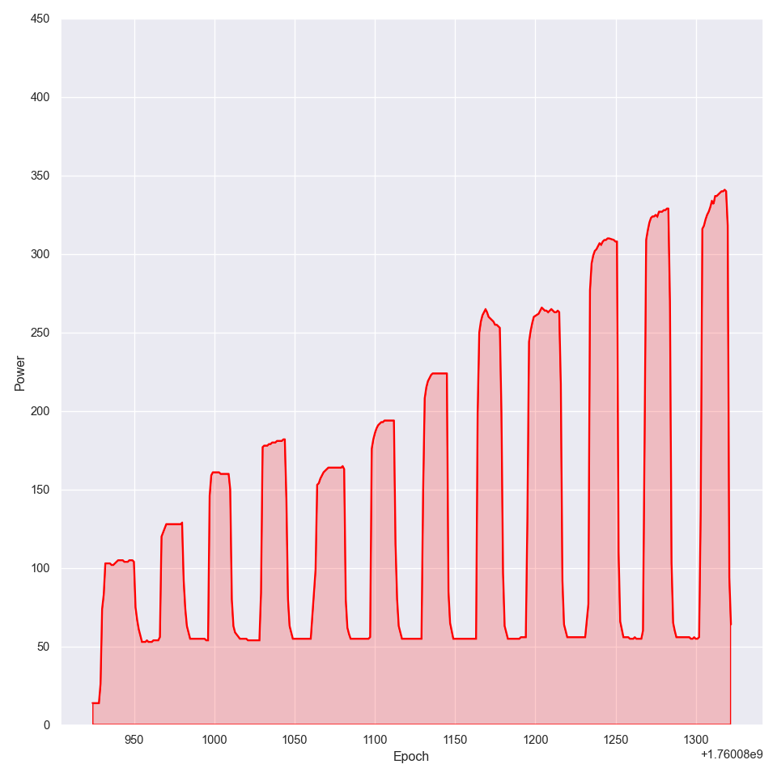

# Examples of data graphs are the following

Example of the total power graph:

One can clearly see an increase with system size.

Example of gpu power graph:

One can see the same trend here, albeit with more data points.
