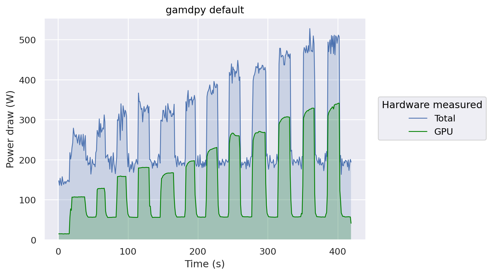
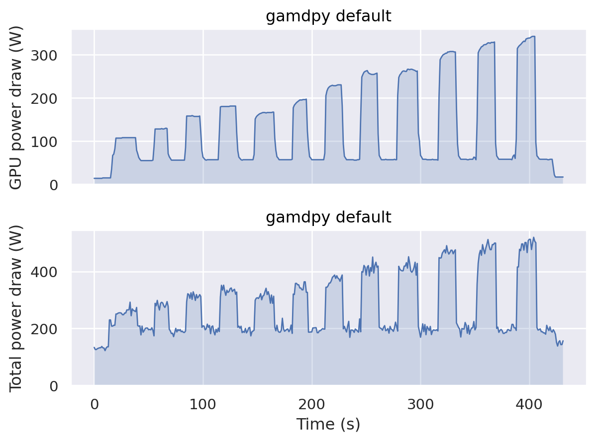
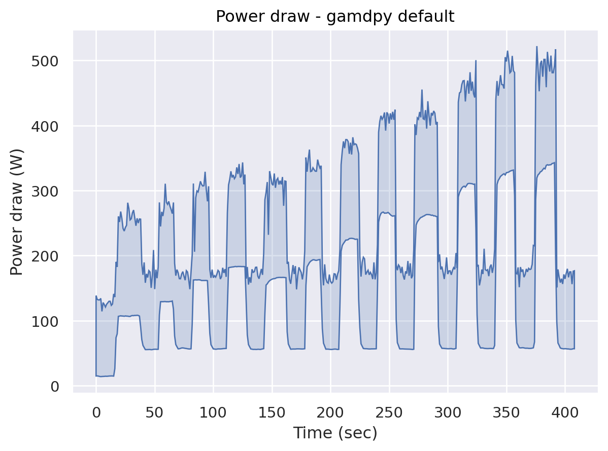

# Interactive examples of data presentation


```python
import pandas as pd
import seaborn.objects as so
```

## Data structure


```python
identifier = "default"  # FIXME: set identifier of csv dataset

gpu = pd.read_csv(f"csv/{identifier}-gpu.csv")
gpu = pd.DataFrame({
    "time": gpu["time"],
    "power": gpu["power"],
})

total = pd.read_csv(f"csv/{identifier}-total.csv")

combined = pd.merge(gpu, total, how="inner", on="time", suffixes=("_gpu", "_total"))
```

## Presentation & analysis

### Stacked graphs

Displays two graphs stacked on top of each other. Easily readable.


```python
(
    so.Plot(data=combined, x=combined.index)
    .add(so.Area(edgewidth=0), y="power_total")
    .add(so.Line(linewidth=1), y="power_total", label="Total")
    .add(so.Area(edgewidth=0, color="green"), y="power_gpu")
    .add(so.Line(linewidth=1, color="green"), y="power_gpu", label="GPU")
    .label(
        x="Time (s)",
        y="Power draw (W)",
        title=f"gamdpy {identifier}",
        legend="Hardware measured"
    )
)#.save(f"fig/{identifier}-stacked")  # uncomment to save
```


    

    


### Paired graph

Displays two graphs side by side. Might have a purpose in the report later on.


```python
(
    so.Plot(data=combined, x=combined.index)
    .pair(y=["power_gpu", "power_total"])
    .add(so.Area(edgewidth=0)).add(so.Line(linewidth=1))
    .label(
        x="Time (s)",
        y0="GPU power draw (W)",
        y1="Total power draw (W)",
        title=f"gamdpy {identifier}"
    )
)#.save(f"fig/{identifier}-paired")
```


    

    


### Band graph

Displays the interval between two y-values. Looks kinda goofy at this point.


```python
(
    so.Plot(combined, x=combined.index, ymin="power_gpu", ymax="power_total")
    .add(so.Band(edgewidth=1))
    .label(
        x="Time (sec)",
        y="Power draw (W)",
        title=f"Power draw - gamdpy {identifier}"
    )
)#.save(f"fig/{identifier}-band")
```


    

    


